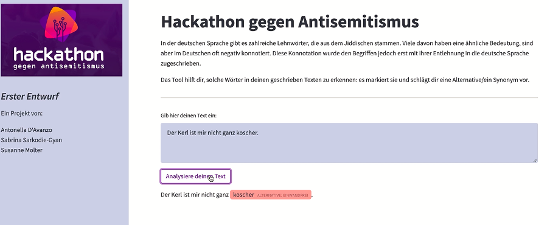

# PROJEKTBESCHREIBUNG
    
*Problem*

In der deutschen Sprache gibt es zahlreiche Lehnwörter, die aus dem Jiddischen stammen. Viele dieser Wörter sind jedoch 
im Deutschen negativ konnotiert (z.B. Schachern – von „sachern“, dem jiddischen Ausdruck für „Handel treiben“) und 
werden bis heute unreflektiert verwendet.

*Lösung*

Mithilfe unseres Web-Tools sollen in geschrieben Texten jiddische Wörter gefunden und markiert werden. Die erfolgt 
durch NLP (natural language processing)/Text Analyse-Methoden. Dem Autor/der Autorin wird die ursprüngliche Bedeutung 
des Begriffs angegeben und ggf. eine Alternative/ein Synonym vorschlagen. 
Unser Tool hilft Nutzer:innen ihren Sprachgebrauch zu sensibilisieren. Ein Bewusstmachen dieser 
Mechanismen ist notwendig, um entsprechende diskriminierende Wörter nicht weiterzuverwenden und durch passendere 
Synonyme zu ersetzen. 

Unser Tool kann von allem Menschen genutzt werden, die Texte erstellen und überprüfen wollen, ob diese jiddische Wörter
enthalten, wie zum Beispiel Texte von Institutionen, journalistische Texte, Schulen und Unis.

## Quellen
* **Antisemitismus in der Sprache**, Ronen Steinke, *Bibliograph. Instit. GmbH*  
* ...

## Status
TODOs:
1. Hosting;
2. Weiteres Stemming ausprobieren;
3. Wortliste vervollständigen (im Moment arbeiten wir mit einem Ausschnitt);
4. Frontend Verbesserungen;
5. Accessibility.

## Ausblick
Mögliche Weiterentwicklungen der App:
1. Eine Alternative zum Kopieren des Textes in die App wären Add-ons für Browser, die mit einem Klick die Analyse eines 
Textes auf einer Webseite ermöglichen.
2. Ebenso kann ein Plugin für Wordpress oder weitere Content Management Systeme (CMS) entwickelt werden, damit das Tool
in einem professionellen Umfeld, z.B. von Verlage, genutzt werden kann.
3. Das Backend kann auch erweitert werden, indem bei dem Auftreten eines aus dem Jiddischen stammenden Wortes auch das 
Sentiment des Textes analysiert werden kann.

## Team
 Antonella D'Avanzo  
 Sabrina Sarkodie-Gyan  
 Susanne Molter 
